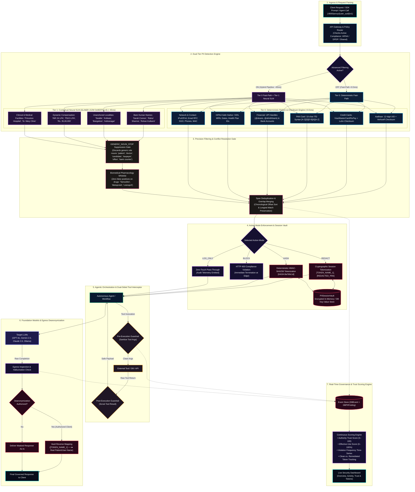

# GuardIAn: Final PII Detection Architecture & Mathematical Scoring Formulas

**Document Version:** 2.0 (Final Enterprise & Hackathon Submission Edition)  
**System:** GuardIAn — The Invisible Privacy & Governance Layer for Generative AI & Autonomous Agents  
**Compliance Standards:** HIPAA Safe Harbor (18 PHI Categories) & Indian Digital Personal Data Protection Act 2023 (27 DPDP Categories)  
**Date:** October 10, 2026  
**Interactive Visualizer:** Accessible live at [http://localhost:8000/architecture](http://localhost:8000/architecture) or [`DOCS/architecture_viewer.html`](file:///Users/bhushan/Projects/Hackathon/DOCS/architecture_viewer.html)

---

## 1. Executive Summary

GuardIAn implements a **dual-tier, zero-trust governance guardrail** designed to protect enterprise LLM interactions and autonomous agent swarms from data leakage. The platform combines:
1. **Sub-Millisecond Deterministic Fast-Path (`<0.5ms`)**: Enforces cryptographic and grammar-based checksums for structured identifiers (Aadhaar, PAN, SSN, Credit Cards, UPI, MRN).
2. **Contextual Neural SLM (`~45ms`)**: Uses GLiNER Small v2.1 (152M params) to identify unstructured, unanchored human names, localities, and compensation packages with zero biomedical false positives.
3. **Dual-Sided Tool Call Interception**: Pre-execution argument sanitization and post-execution output scrubbing.
4. **Mathematical Trust & Governance Engine**: Continuous real-time scoring of client connections, token usage efficiency, and agent trustworthiness.

---

## 2. Final PII Detection Architecture Diagram

### Master Architectural Flow (Mermaid)

---

## 3. Mathematical & Algorithmic Formulas

GuardIAn computes continuous metrics across security, governance, and deterministic verification. Below is the complete mathematical definition for each formula implemented in the platform.

---

### Formula 1: Authority-Trust Score (0 – 100)

The **Authority-Trust Score** quantifies user and agent reliability. Trust grows exponentially with clean behavior streaks and drops sharply with severity-weighted penalties when violations occur.

$$\text{Authority-Trust Score} = \text{Clamp}_{0.0}^{100.0}\Big(\text{Base Score} + \text{Streak Bonus} - \text{Cumulative Penalties}\Big)$$

#### Detailed Components:

1. **Base Score ($\text{Base}$):**
   $$\text{Base} = 80.0$$
   *(Default starting score for standard users and agents).*

2. **Streak Bonus ($\text{Bonus}_{\text{streak}}$):**
   $$\text{Bonus}_{\text{streak}} = (100.0 - \text{Base}) \times \left(1 - e^{-\frac{\text{current\_streak}}{25.0}}\right) = 20.0 \times \left(1 - e^{-\frac{\text{current\_streak}}{25.0}}\right)$$
   * $\text{current\_streak}$: The number of consecutive clean requests since the last violation.
   * As $\text{current\_streak} \to \infty$, $\text{Bonus}_{\text{streak}} \to 20.0$ pts.
   * If any request violates compliance, $\text{current\_streak}$ immediately resets to $0$, dropping the bonus to $0.0$.

3. **Cumulative Penalties ($\text{Penalties}$):**
   $$\text{Cumulative Penalties} = \sum_{k \in \text{Violations}} \text{Penalty}(k)$$
   For each violating event $k$, the penalty is determined by the **highest severity entity** leaked in that request:
   $$\text{Penalty}(k) = \max_{e \in \text{Entities}(k)} \Big(\text{SEVERITY\_PENALTY}(e)\Big)$$

#### Severity Penalty Table:

| Severity Level | PII / PHI Entity Class | Penalty Value | Risk Justification |
| :---: | :--- | :---: | :--- |
| ⛔ **Critical** | `MRN`, `HEALTH_ID`, `MEDICAL_RECORD`, `BIOMETRIC`, `BANK_ACCOUNT`, `UPI_ID`, `FINANCIAL` | **$-25.0$ pts** | Irreversible statutory breach, health record exposure, financial fraud vulnerability. |
| 🔴 **High** | `SSN`, `CREDIT_CARD`, `PASSPORT`, `AADHAAR`, `PAN`, `VOTER_ID`, `DRIVING_LICENSE`, `TAX_ID` | **$-15.0$ pts** | Primary government identity theft risk, high statutory penalty. |
| 🟡 **Medium** | `EMAIL`, `PHONE`, `TELEPHONE`, `FAX`, `STREET_ADDRESS`, `DEVICE_ID`, `IP_ADDRESS` | **$-8.0$ pts** | Direct personal contact vector, reversible exposure. |
| 🟢 **Low** | Unanchored `NAME`, `GEO_DATA` (City), `SALARY`, `AGE_GENDER`, `STUDENT_ID` | **$-3.0$ pts** | Semi-public contextual identifier, lowest direct exploitability. |

#### Trust Tier Classification Boundaries:

$$\text{Trust Tier} = \begin{cases} 
\text{Tier 1: High Authority (Emerald)}, & \text{Score} \ge 85.0 \\ 
\text{Tier 2: Trusted Operator (Cyan)}, & 65.0 \le \text{Score} < 85.0 \\ 
\text{Tier 3: Moderate Trust (Amber)}, & 40.0 \le \text{Score} < 65.0 \\ 
\text{Tier 4: Restricted / Quarantined (Rose)}, & \text{Score} < 40.0 
\end{cases}$$

---

### Formula 2: Effective-Use Score (0% – 100%)

The **Effective-Use Score** measures the proportion of requests that passed through the proxy with **zero guardrail intervention**.

$$\text{Effective-Use Score (\%)} = \begin{cases} 
\left(\dfrac{\text{Clean Requests}}{\text{Total Requests}}\right) \times 100, & \text{if } \text{Total Requests} > 0 \\ 
100.0\%, & \text{if } \text{Total Requests} = 0 
\end{cases}$$

Where:
$$\text{Clean Requests} = \text{Total Requests} - \big(\text{Blocked} + \text{Redacted} + \text{Hashed} + \text{Logged} + \text{Denied}\big)$$

* **Interpretation:** A clean request represents an uncompromised interaction where the user or agent sent zero PII/PHI. Any intervention (redaction, blocking, hashing) indicates non-compliant behavior.

---

### Formula 3: Violation Frequency Percentage & Time-Series

The aggregate violation frequency across the evaluated window is:

$$\text{Violation Frequency (\%)} = \begin{cases} 
\left(\dfrac{\text{Total Violations}}{\text{Total Requests}}\right) \times 100, & \text{if } \text{Total Requests} > 0 \\ 
0.0\%, & \text{if } \text{Total Requests} = 0 
\end{cases}$$

Where:
$$\text{Total Violations} = \text{Blocked} + \text{Redacted} + \text{Hashed} + \text{Logged} + \text{Denied}$$

In the dashboard UI, this metric is rendered as a **30-day time-series daily stacked bar chart**:
$$\vec{V}(d) = \Big[\text{Redacted}(d), \, \text{Blocked}(d), \, \text{Hashed}(d), \, \text{Logged}(d), \, \text{Clean}(d)\Big] \quad \text{for } d \in [t-29, \, t]$$

---

### Formula 4: Token Tracking & Clean Token Ratio

To prevent prompt bloat and monitor token exposure:

$$\text{Total Tokens} = \sum_{e \in \text{Events}} \big(\text{Prompt Tokens}(e) + \text{Completion Tokens}(e)\big)$$

$$\text{Clean Tokens} = \sum_{e \in \text{Clean Events}} \big(\text{Prompt Tokens}(e) + \text{Completion Tokens}(e)\big)$$

$$\text{Remediated Tokens} = \text{Total Tokens} - \text{Clean Tokens}$$

$$\text{Clean Token Ratio (\%)} = \left(\frac{\text{Clean Tokens}}{\text{Total Tokens}}\right) \times 100$$

---

### Formula 5: Verhoeff Checksum Algorithm (Indian Aadhaar 12-Digit UID)

Aadhaar numbers must satisfy the **Verhoeff algorithm**, a base-10 check digit scheme based on the dihedral group $D_5$ (symmetries of a regular pentagon):

$$\left(\sum_{i=0}^{n-1} d\Big(i, \, p\big(i \bmod 8, \, c_i\big)\Big)\right) \equiv 0 \pmod{10}$$

Where:
* $c_0, c_1, \dots, c_{n-1}$ are the digits of the Aadhaar number in **reverse order** ($c_0$ is the check digit).
* $d(j, k)$ is the $D_5$ non-commutative multiplication operation defined by a $10 \times 10$ Cayley table.
* $p(pos, val)$ is the permutation table defined over 8 permutation cycles.
* **Negative Control Enforcement:** Numbers starting with `0` or `1` are rejected ($c_{11} \in [2, 9]$) to prevent collisions with timestamps or system serial numbers.

---

### Formula 6: Luhn Checksum Algorithm (Credit Cards & Financial Instruments)

Credit card numbers (Visa, MasterCard, RuPay, Amex) are validated using the **Luhn modular arithmetic check** (ISO/IEC 7812-1):

$$\left(\sum_{i=1}^{k} \psi\big(d_i, \, i\big)\right) \equiv 0 \pmod{10}$$

Where the digits $d_k, d_{k-1}, \dots, d_1$ are numbered from right to left ($d_1$ is the check digit), and:

$$\psi(d, i) = \begin{cases} 
d, & \text{if } i \text{ is odd} \\ 
2d, & \text{if } i \text{ is even and } 2d < 10 \\ 
2d - 9, & \text{if } i \text{ is even and } 2d \ge 10 
\end{cases}$$

---

### Formula 7: ITD Syntax Grammar (PAN Card 10-Character Identifier)

Indian Permanent Account Numbers (PAN) follow the Income Tax Department (ITD) deterministic grammar:

$$\text{PAN} \in \mathcal{L}(\Sigma) \quad \text{where } \Sigma = [A-Z0-9]$$

$$\text{Structure: } \underbrace{[A-Z]_1 [A-Z]_2 [A-Z]_3}_{\text{Series (AAA–ZZZ)}} \; \underbrace{[A-Z]_4}_{\text{Taxpayer Status}} \; \underbrace{[A-Z]_5}_{\text{Surname Initial}} \; \underbrace{[0-9]_6 [0-9]_7 [0-9]_8 [0-9]_9}_{\text{Sequential Range (0001–9999)}} \; \underbrace{[A-Z]_{10}}_{\text{Alphabetic Check Digit}}$$

* **Taxpayer Status Constraints:**
  $$[A-Z]_4 \in \{ \mathbf{P} \text{ (Individual)}, \, \mathbf{C} \text{ (Company)}, \, \mathbf{H} \text{ (HUF)}, \, \mathbf{F} \text{ (Firm)}, \, \mathbf{A} \text{ (AOP)}, \, \mathbf{T} \text{ (Trust)}, \, \mathbf{B} \text{ (BOI)}, \, \mathbf{L} \text{ (Local)}, \, \mathbf{J} \text{ (Artificial)}, \, \mathbf{G} \text{ (Gov)} \}$$
* Any 10-character token with a trailing digit (e.g. `ABCDE12345`) is **rejected** as a warehouse SKU/inventory part code.

---

### Formula 8: GLiNER Neural SLM Zero-Shot Span Scoring

GLiNER computes entity spans using a bidirectional cross-attention DeBERTa-v3 backbone:

1. **Span Context Representation:** For token sequence $w_1, \dots, w_L$:
   $$\mathbf{h}_{\text{span}}(i, j) = \text{FFN}\Big([\mathbf{h}_i \,;\, \mathbf{h}_j]\Big) \in \mathbb{R}^d$$

2. **Entity Label Representation:** For dynamic label query $l \in \{\text{"person name"}, \text{"city"}, \text{"hospital"}, \dots\}$:
   $$\mathbf{e}_{\text{label}}(l) = \text{Encoder}(l) \in \mathbb{R}^d$$

3. **Bilinear Classification Probability:**
   $$P\big(\text{span}(i,j) = l\big) = \sigma\Big(\mathbf{h}_{\text{span}}(i, j)^{\top} \mathbf{W}_{\text{bilinear}} \mathbf{e}_{\text{label}}(l)\Big)$$

4. **Inference Decision Boundary:**
   $$\text{Candidate Span Accepted} \iff P\big(\text{span}(i,j) = l\big) \ge \tau \quad (\tau = 0.52)$$

5. **Stop-Word & Role Noun Suppression:**
   $$\text{If } \text{Lower}(\text{span}) \in \text{GENERIC\_NOUN\_STOP} \implies \text{Drop Span}$$

---

### Formula 9: Cryptographic Deterministic Pseudonymization (HMAC-SHA256)

When the platform is configured in `HASH` action mode, raw PII is mapped to a deterministic, collision-resistant token:

$$\text{Token}_{\text{HASH}} = \text{"[HASH:"} + \text{Hex}\Big(\text{HMAC-SHA256}\big(K_{\text{secret}}, \, \text{Raw\_PII}\big)\Big)[0:8] + \text{"]"}$$

* **Properties:**
  * **Deterministic:** Identical PII entities map to the exact same hash across prompts, preserving conversational co-reference without leaking identity.
  * **One-Way:** Computationally infeasible to reverse without knowing $K_{\text{secret}}$.

---

## 4. Concrete Worked Numerical Examples

To illustrate how these formulas operate in production, consider the following step-by-step lifecycle of an active user/agent session:

### Scenario Walkthrough:

* **Starting State:**
  * User begins with $\text{Base} = 80.0$ points.
  * $\text{current\_streak} = 0$, $\text{Cumulative Penalties} = 0.0$.
  * Initial Score: $80.0 + 0 - 0 = \mathbf{80.0}$ (Tier 2: Trusted Operator).

---

#### Step 1: User completes 15 consecutive clean requests
* Clean requests: $15$. Total requests: $15$.
* $\text{current\_streak} = 15$.
* Streak Bonus:
  $$\text{Bonus} = 20.0 \times \left(1 - e^{-\frac{15}{25.0}}\right) = 20.0 \times \left(1 - e^{-0.60}\right) = 20.0 \times (1 - 0.5488) = 20.0 \times 0.4512 = \mathbf{+9.02} \text{ pts}$$
* **Authority-Trust Score:**
  $$\text{Score} = 80.0 + 9.02 - 0.0 = \mathbf{89.0} \implies \text{\bf Tier 1: High Authority (Emerald)}$$
* **Effective-Use Score:**
  $$\text{Effective-Use} = \left(\frac{15}{15}\right) \times 100 = \mathbf{100.0\%}$$

---

#### Step 2: Request #16 leaks an unmasked Social Security Number (SSN)
* Event: Leaked `SSN: 987-65-4320`.
* Entity Type: `SSN` $\implies$ Severity: **High**.
* Penalty applied: $-15.0$ pts.
* **Streak effect:** $\text{current\_streak}$ immediately resets from $15 \to \mathbf{0}$.
* $\text{Bonus}_{\text{streak}} = 20.0 \times (1 - e^0) = \mathbf{0.0}$ pts.
* Cumulative Penalties: $0.0 + 15.0 = \mathbf{15.0}$ pts.
* **New Authority-Trust Score:**
  $$\text{Score} = 80.0 + 0.0 - 15.0 = \mathbf{65.0} \implies \text{\bf Demoted to Tier 2: Trusted Operator}$$
* **Effective-Use Score:**
  $$\text{Clean} = 15, \quad \text{Total} = 16 \implies \text{Score} = \left(\frac{15}{16}\right) \times 100 = \mathbf{93.8\%}$$

---

#### Step 3: Request #17 leaks a Medical Record Number (MRN)
* Event: Leaked `MRN: 9048210`.
* Entity Type: `MRN` $\implies$ Severity: **Critical**.
* Penalty applied: $-25.0$ pts.
* $\text{current\_streak} = 0$.
* Cumulative Penalties: $15.0 + 25.0 = \mathbf{40.0}$ pts.
* **New Authority-Trust Score:**
  $$\text{Score} = 80.0 + 0.0 - 40.0 = \mathbf{40.0} \implies \text{\bf Demoted to Tier 3: Moderate Trust}$$
* **Effective-Use Score:**
  $$\text{Clean} = 15, \quad \text{Total} = 17 \implies \text{Score} = \left(\frac{15}{17}\right) \times 100 = \mathbf{88.2\%}$$

---

#### Step 4: User undergoes remediation and sends 25 clean requests
* Clean requests: $15 + 25 = 40$. Total requests: $17 + 25 = 42$.
* $\text{current\_streak} = 25$.
* Streak Bonus:
  $$\text{Bonus} = 20.0 \times \left(1 - e^{-\frac{25}{25.0}}\right) = 20.0 \times \left(1 - e^{-1.0}\right) = 20.0 \times (1 - 0.3679) = 20.0 \times 0.6321 = \mathbf{+12.64} \text{ pts}$$
* Penalties remain: $40.0$ pts.
* **Recovered Authority-Trust Score:**
  $$\text{Score} = 80.0 + 12.64 - 40.0 = \mathbf{52.6} \implies \text{\bf Tier 3: Moderate Trust}$$
  *(Notice: The user successfully recovers points through diligence, but historical violations prevent an instant jump to Tier 1 without administrative rating reset).*
* **Effective-Use Score:**
  $$\text{Clean} = 40, \quad \text{Total} = 42 \implies \text{Score} = \left(\frac{40}{42}\right) \times 100 = \mathbf{95.2\%}$$

---

## 5. Summary Table: All Formulas at a Glance

| Metric / Algorithm | Formula | Scope / Role | Target / Range |
| :--- | :--- | :--- | :---: |
| **Authority-Trust Score** | $\text{Clamp}_0^{100}\big(80.0 + 20(1 - e^{-\text{streak}/25}) - \sum \text{Penalties}\big)$ | Continuous User & Agent Trust Rating | $0.0 - 100.0$ |
| **Effective-Use Score** | $(\text{Clean Requests} / \text{Total Requests}) \times 100$ | Clean Request Operational Efficiency | $0.0\% - 100.0\%$ |
| **Violation Frequency** | $(\text{Violations} / \text{Total Requests}) \times 100$ | Compliance Failure Ratio | $0.0\% - 100.0\%$ |
| **Clean Token Ratio** | $(\text{Clean Tokens} / \text{Total Window Tokens}) \times 100$ | LLM Token Consumption Cleanliness | $0.0\% - 100.0\%$ |
| **Verhoeff Checksum** | $\sum d(i, p(i \bmod 8, c_i)) \equiv 0 \pmod{10}$ | Deterministic 12-digit Indian Aadhaar | Boolean Pass/Fail |
| **Luhn Algorithm** | $\sum \psi(d_i, i) \equiv 0 \pmod{10}$ | Visa, MasterCard, RuPay Card Validation | Boolean Pass/Fail |
| **ITD PAN Grammar** | $[A-Z]^3[A-Z][A-Z][0-9]^4[A-Z]$ | 10-char Alphanumeric Income Tax ID | Boolean Pass/Fail |
| **GLiNER SLM Bilinear Score** | $\sigma(\mathbf{h}_{\text{span}}^{\top} \mathbf{W} \mathbf{e}_{\text{label}}) \ge 0.52$ | Contextual Unanchored Name & Geo NER | Confidence $[0, 1]$ |
| **HMAC-SHA256 Token** | $\text{"[HASH:"} + \text{HMAC-SHA256}(K, \text{text})[:8] + \text{"]"}$ | Reversible/Tamper-Evident Pseudonym | 8-byte Hex Token |

---

## 6. How to Access and Review

* **Markdown Document:** [`DOCS/FINAL_PII_ARCHITECTURE_AND_FORMULAS.md`](file:///Users/bhushan/Projects/Hackathon/DOCS/FINAL_PII_ARCHITECTURE_AND_FORMULAS.md)
* **Interactive Architecture Visualizer:** Open [http://localhost:8000/architecture](http://localhost:8000/architecture) in your web browser.
* **Full Benchmark Audit:** See [`DOCS/FULL_50_SCENARIO_COMPLIANCE_BENCHMARK.md`](file:///Users/bhushan/Projects/Hackathon/DOCS/FULL_50_SCENARIO_COMPLIANCE_BENCHMARK.md) for the 50-scenario compliance audit.
