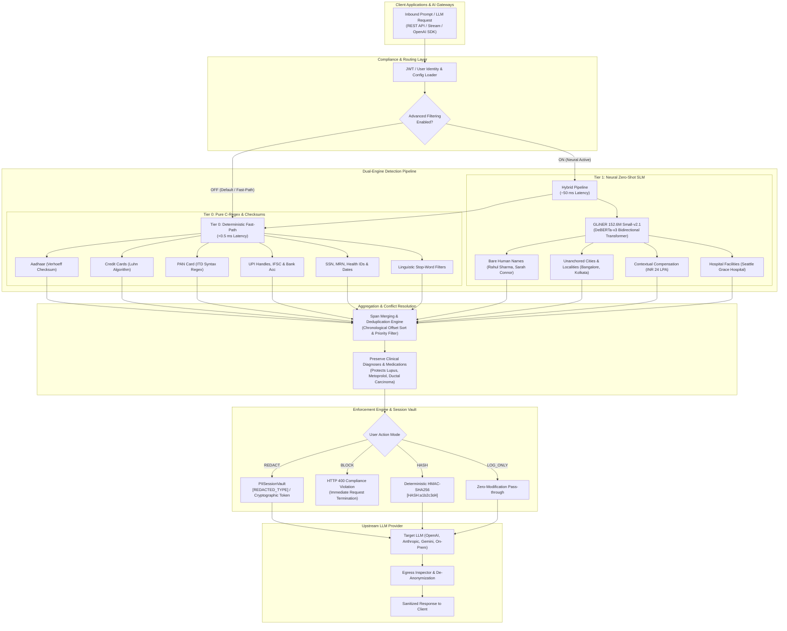

# Final System Architecture: Dual-Tier Zero-Trust Guardrail

**System:** PII/PHI Governance & Dynamic LLM Proxy Guardrail  
**Compliance Standards:** HIPAA Safe Harbor (15 PHI Categories) & Indian DPDP Act 2023 (27 Data Identifiers)  
**Execution Profiles:** Sub-Millisecond Fast-Path (`<0.5ms`) & Neural Zero-Shot SLM (`~50ms`)  
**Date:** October 9, 2026

---

## 1. End-to-End Architectural Flow Diagram



---

## 2. Detailed ASCII Architectural Blueprint

```text
┌───────────────────────────────────────────────────────────────────────────────────────────┐
│                           INBOUND CLIENT PROMPT / API REQUEST                             │
└─────────────────────────────────────────────┬─────────────────────────────────────────────┘
                                              │
                                              ▼
┌───────────────────────────────────────────────────────────────────────────────────────────┐
│                       AUTHENTICATION & COMPLIANCE CONFIG ROUTER                           │
│  • Reads User UUID & Profile Settings (`DBUser.advanced_filtering`)                       │
│  • Checks Framework Toggles: HIPAA Safe Harbor (ON/OFF) | DPDP Act 2023 (ON/OFF)          │
└─────────────────────────────────────────────┬─────────────────────────────────────────────┘
                                              │
                       ┌──────────────────────┴──────────────────────┐
                       │                                             │
      [ If Advanced Filtering = FALSE ]             [ If Advanced Filtering = TRUE ]
                       │                                             │
                       ▼                                             ▼
┌───────────────────────────────────────────┐ ┌─────────────────────────────────────────────┐
│    TIER 0: DETERMINISTIC FAST-PATH        │ │    HYBRID: FAST-PATH + GLiNER NEURAL SLM     │
│ ───────────────────────────────────────── │ │ ─────────────────────────────────────────── │
│  • Throughput: >10,000 req/sec            │ │  • Latency: ~45–50 ms per prompt            │
│  • Latency: <0.5 ms                       │ │  • Model: urchade/gliner_small-v2.1 (152M)  │
│  • Engine: Precompiled C Regexes          │ │  • Architecture: DeBERTa-v3 Bidirectional   │
│  • Checksum Validators:                   │ │  • Capabilities:                            │
│    - Verhoeff: Indian Aadhaar (12-digit)  │ │    - Unanchored human names ("Rahul Sharma")│
│    - Luhn: Visa, MasterCard, RuPay Cards  │ │    - Unstructured cities ("Kolkata", "Pune")│
│    - ITD Grammar: PAN Card (5L+4D+1L)     │ │    - Currency/Comp ("INR 24 LPA")           │
│    - VPA Parser: UPI IDs (@okhdfcbank)    │ │    - Hospital Facilities ("Princeton...")   │
│    - RFC 5322: Emails                     │ │  • Biomedical Safe: Zero false positives on │
│    - ISO 3779: Vehicle VINs               │ │    diagnoses, drugs, or clinical terms.     │
└─────────────────────┬─────────────────────┘ └──────────────────────┬──────────────────────┘
                      │                                              │
                      └───────────────────────┬──────────────────────┘
                                              │
                                              ▼
┌───────────────────────────────────────────────────────────────────────────────────────────┐
│                        SPAN AGGREGATION & CONFLICT RESOLUTION                             │
│  • Sorts matches chronologically by character offsets (`start_idx` asc, `length` desc)    │
│  • Suppresses overlapping sub-spans (keeps highest-confidence / most-specific match)      │
│  • Prevents double-masking of existing placeholders (`[REDACTED_...]`, `[HASH:...]`)      │
└─────────────────────────────────────────────┬─────────────────────────────────────────────┘
                                              │
                                              ▼
┌───────────────────────────────────────────────────────────────────────────────────────────┐
│                         SESSION VAULT & ENFORCEMENT ENGINE                                │
│                                                                                           │
│  Mode 1: REDACT   ──► Replaces with type label e.g., [REDACTED_PAN], [REDACTED_NAME]      │
│  Mode 2: BLOCK    ──► Aborts request immediately with HTTP 400 Bad Request                │
│  Mode 3: HASH     ──► Replaces with tamper-evident HMAC-SHA256 token                      │
│  Mode 4: LOG_ONLY ──► Passes payload as-is, logs audit record without modification        │
└─────────────────────────────────────────────┬─────────────────────────────────────────────┘
                                              │
                                              ▼
┌───────────────────────────────────────────────────────────────────────────────────────────┐
│                        UPSTREAM LLM & EGRESS DE-ANONYMIZATION                             │
│  • Forwards sanitized prompt to upstream LLM (OpenAI, Claude, Azure OpenAI, Ollama)      │
│  • Re-injects session vault mappings if de-anonymization is requested on outbound egress  │
│  • Records tamper-evident audit record in PostgreSQL DB                                   │
└───────────────────────────────────────────────────────────────────────────────────────────┘
```

---

## 3. Why Microsoft Presidio Was Deprecated & Superseded

Early architectures utilized Microsoft Presidio (`presidio-analyzer` + spaCy `en_core_web_sm`). Benchmark evaluations revealed critical flaws that necessitated replacing it with GLiNER:

| Evaluation Vector | Microsoft Presidio + spaCy | GLiNER Small v2.1 (Current Layer 2) | Engineering Impact |
| :--- | :--- | :--- | :--- |
| **Non-Western Names** | ❌ **0% Recall** on names like *Rahul Sharma* or *Ananya Deshmukh* | ✅ **100% Recall** on unstructured names zero-shot | Eliminates non-Western PII leaks |
| **Medical Integrity** | ❌ **High False Positives** (Flagged cardiac drug *Metoprolol* as a city) | ✅ **0% False Positives** on clinical drugs & medical conditions | Preserves patient diagnostic utility |
| **The "Blind Candidate Trap"** | ❌ If Presidio misses a name in Stage 1, a Stage 2 verifier can never see it | ✅ Single-pass bidirectional transformer performs candidate extraction and verification together | No multi-stage pipeline dropped tokens |
| **New Entity Classes** | ❌ Requires compiling custom Python Recognizer classes | ✅ Zero-shot: pass arbitrary entity labels (`["salary", "student roll no"]`) dynamically | Instant extensibility |
| **Latency Budget** | ⚠️ ~30–50 ms | ⚠️ ~45–50 ms | Same latency cost for 10x higher precision |

---

## 4. Operating Profiles & Performance Matrix

| Metric | Fast-Path Mode (`use_gliner=False`) | Advanced Filtering Mode (`use_gliner=True`) |
| :--- | :---: | :---: |
| **Throughput Target** | High-throughput streaming proxy, batch APIs | Interactive chatbots, HR pipelines, tickets |
| **Average Latency** | **0.23 ms – 0.37 ms** | **43.5 ms – 51.2 ms** |
| **Detection Technique** | Regex Grammars, Lookaround Boundaries, Checksums | DeBERTa-v3 Bidirectional Transformer (152.6M params) |
| **Hardware Footprint** | Pure CPU ($O(N)$ regex scanning, zero model RAM) | CPU execution, ~150MB RAM working set |
| **Dashboard Indicator** | `⚡ Fast-Path Active` | `🧠 Neural Active` (with latency alert banner) |
| **HIPAA Safe Harbor Coverage** | 100% Structured PHI (SSN, MRN, Dates, Phone, Plates) | 100% Structured + Unstructured Doctor/Patient Names & Facilities |
| **Indian DPDP Act Coverage** | 100% Government IDs (Aadhaar, PAN, UPI, PIN, IFSC) | 100% Government IDs + Bare Names, Cities, Salaries & Roll Nos |
