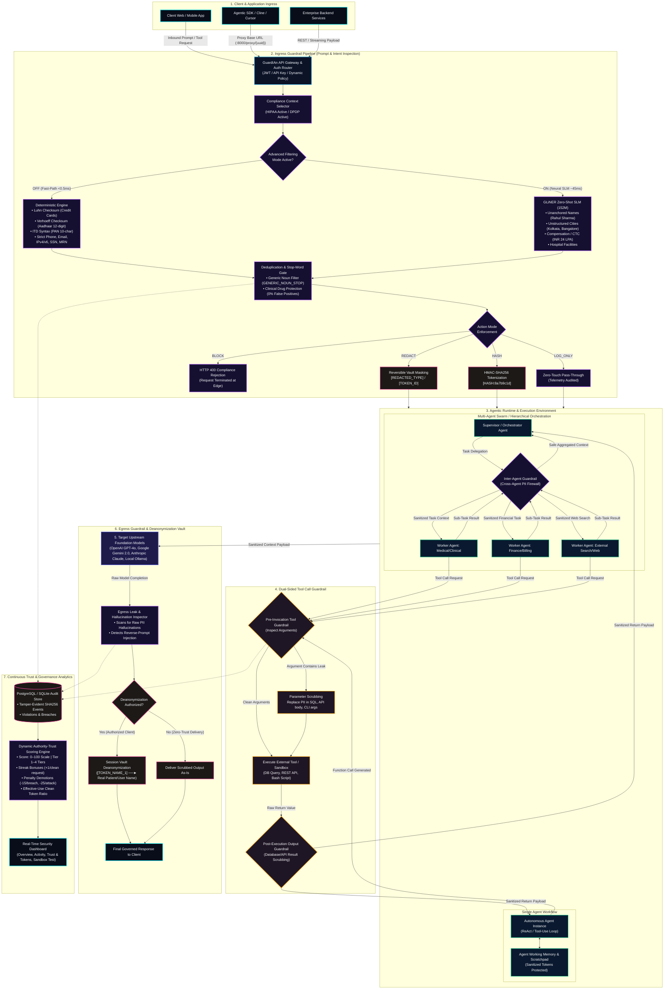
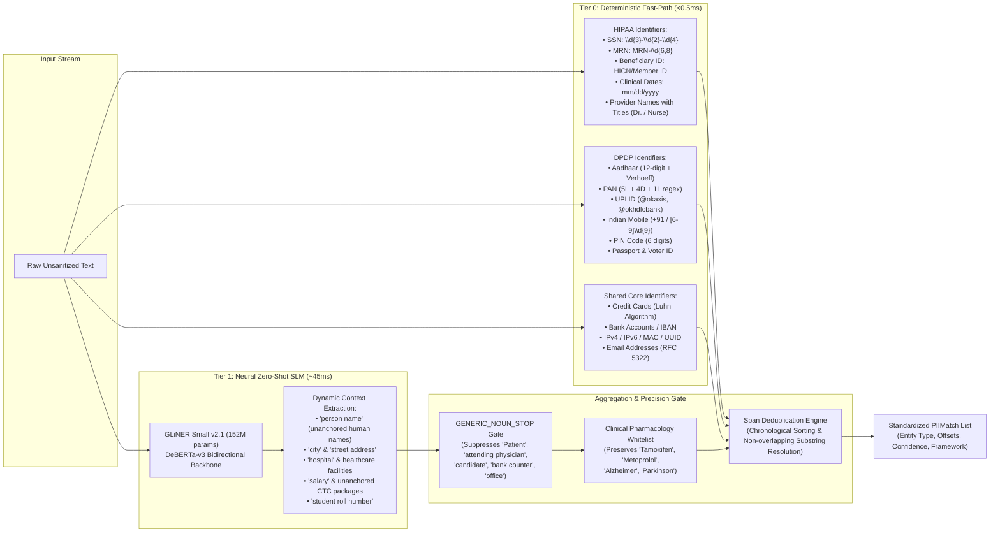
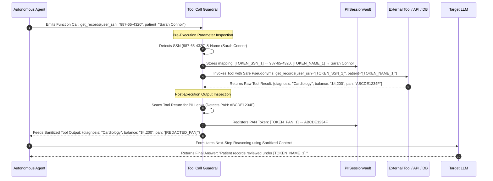
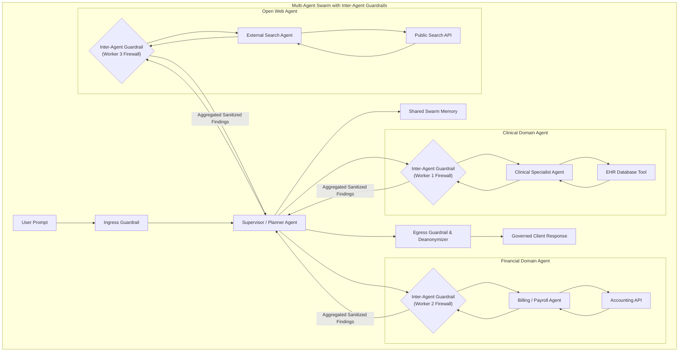

# GuardIAn: Full Enterprise System Architecture Blueprint

**Platform:** GuardIAn — The Invisible Privacy & Governance Layer for Generative AI & Autonomous Agents  
**Compliance Standards:** HIPAA Safe Harbor (18 PHI Categories) & Indian Digital Personal Data Protection Act 2023 (27 DPDP Categories)  
**Agentic Paradigms:** Single-Agent Execution, Multi-Agent Orchestration, Dual-Sided Tool Call Interception  
**Date:** October 10, 2026  
**Interactive Preview:** Open [`DOCS/architecture_viewer.html`](file:///Users/bhushan/Projects/Hackathon/DOCS/architecture_viewer.html) or navigate to `http://localhost:8000/architecture` on the live server.

---

## 1. Master System & Ecosystem Architecture (Mermaid)

---

## 2. In-Depth Subsystem Architectures

### A. Compliance Framework Matrix & Dual-Tier Detection Pipeline

The detection layer enforces **HIPAA Safe Harbor (45 CFR § 164.514)** and the **Indian DPDP Act 2023** via a two-tier hybrid architecture:

---

### B. Dual-Sided Tool Call & Function Execution Guardrail

Autonomous AI agents generate structured function calls (e.g. executing SQL queries, calling external REST APIs, or invoking CLI tools). GuardIAn intercepts tool interactions **both on ingress (before tool execution)** and **on egress (before results reach the agent)**.

---

### C. Single Agent vs. Multi-Agent Orchestration Guardrail

In multi-agent systems, agents delegate tasks and share scratchpads. Without a specialized inter-agent firewall, a breach in one specialized worker agent compromises the entire swarm.

---

## 3. Governance & Authority-Trust Scoring Formula

GuardIAn calculates dynamic security trust scores for all client connections and autonomous agent instances in real time:

$$\text{Authority-Trust Score} = \text{Clamp}_{0}^{100}\Big(\text{Base (80)} + \text{Streak Bonus} - \text{Violation Penalties}\Big)$$

Where:
* **Streak Bonus:** $+1$ point awarded for every consecutive clean prompt ($\text{max} +20$).
* **Minor Violation Penalty (Redacted PII):** $-5$ points per occurrence.
* **Major Compliance Breach (Blocked Request):** $-15$ points per occurrence.
* **Malicious Injection / Attack Attempt:** $-25$ points with immediate tier downgrade.

### Trust Tiers & Access Privileges

| Tier Level | Score Range | Status | Agent Permissions & Capabilities |
| :---: | :---: | :---: | :--- |
| **Tier 1: Master Operator** | $90 - 100$ | 🛡️ Highly Trusted | Full multi-agent orchestration, unrestricted tool access, low-latency fast-path streaming. |
| **Tier 2: Trusted Operator** | $70 - 89$ | 🔒 Standard Secure | Standard agentic execution, mandatory tool argument inspection enabled. |
| **Tier 3: Monitored User** | $40 - 69$ | ⚠️ Elevated Risk | Neural SLM dual-pass mandatory; tool invocation requires strict parameter whitelisting. |
| **Tier 4: Restricted / Quarantined** | $0 - 39$ | 🚨 Zero-Trust Lockdown | Automatic BLOCK mode enforced; external tool calls revoked; audit events flagged to SIEM. |

---

## 4. Verification & Interactive Preview

To interactively view, zoom, and export these architectural diagrams:
1. Open the standalone viewer: [`DOCS/architecture_viewer.html`](file:///Users/bhushan/Projects/Hackathon/DOCS/architecture_viewer.html) in your browser.
2. Or navigate directly to `http://localhost:8000/architecture` on the running API server.
