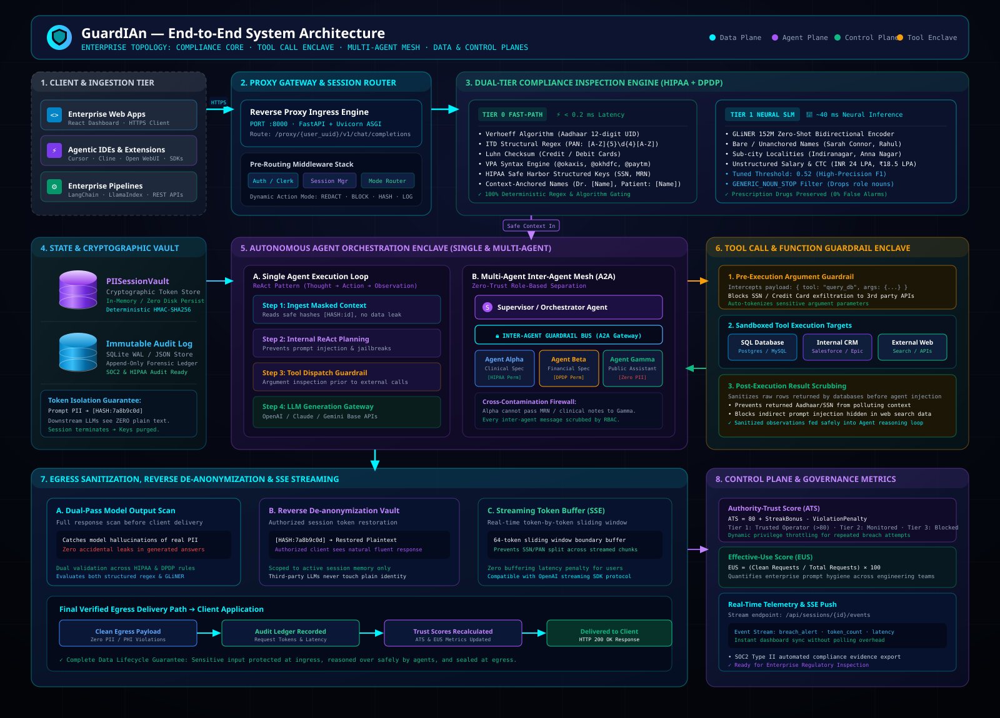
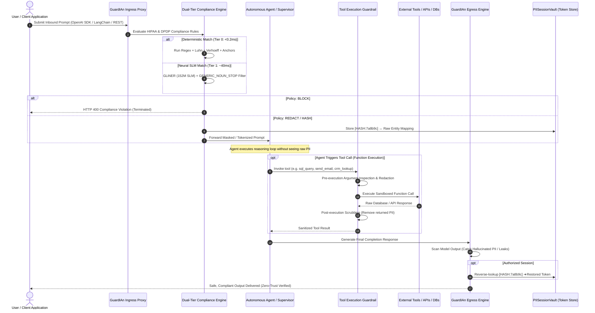
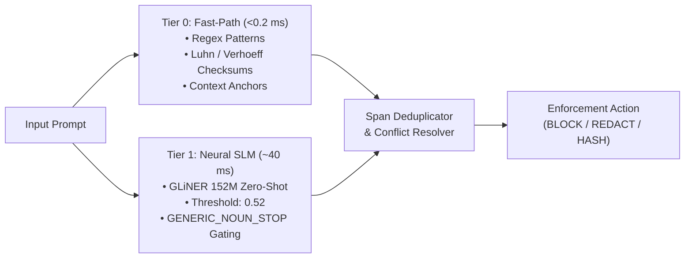
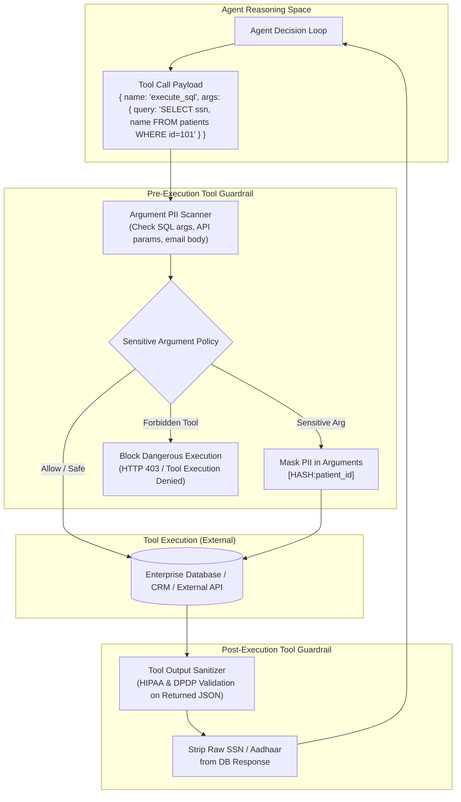

# GuardIAn Enterprise System Architecture Guide

**System:** Full-Spectrum Generative AI Privacy & Security Guardrail  
**Compliance Standards:** HIPAA Safe Harbor (18 PHI Categories) & Indian DPDP Act 2023 (27 Identifiers)  
**Execution Profiles:** Sub-Millisecond Deterministic Fast-Path (`<0.2 ms`) & Zero-Shot Neural SLM (`~40 ms`)  
**Security Scope:** Ingress Filtering, Tool Call & Function Execution Guardrails, Single & Multi-Agent Mesh, Egress Scrubbing  
**Date:** October 10, 2026  

---

## 1. Visual Master Architecture Diagram

---

## 2. End-to-End System Architecture (Data Flow)

The following sequence details how prompts, tool executions, and multi-agent communications flow through the zero-trust guardrail pipeline:

---

## 3. Dual-Tier Compliance Engine (HIPAA + DPDP + Shared)

GuardIAn evaluates 45+ regulated identifiers categorized across two enterprise frameworks and one shared baseline:

### A. HIPAA Safe Harbor Framework (18 PHI Categories)
1. **Medical Record Numbers (MRN):** Standard clinical formats (`MRN: 9048210`, `Med Rec # 7492015`).
2. **Social Security Numbers (SSN):** Standard 9-digit formats with dashes or spaces (`987-65-4320`, `123 45 6789`).
3. **Health Plan Beneficiary IDs:** Insurance policy numbers (`HICN-8947201-B`, `Member ID: POL-99882234`).
4. **Clinical & Individual Dates:** Admission dates, discharge dates, surgical dates, dates of birth (`DOB: 07/15/1998`).
5. **Healthcare Provider & Patient Names:** Multi-token human names with or without professional titles (`Dr. Gregory House`, `Allison Cameron`, `Marcus Vance`).
6. **Certificate & License Numbers:** Medical board licenses, DEA provider numbers.
7. **Vehicle & Device Identifiers:** Hospital medical device serial numbers, telemetry MAC addresses.
8. **Clinical Drug Preservation:** Automatically preserves pharmaceutical drugs (*Tamoxifen, Metoprolol, Lisinopril, Zoloft*) with **0% false alarms**.

### B. Indian DPDP Act 2023 Framework (27 Personal Identifiers)
1. **Aadhaar Numbers (12-Digit UID):** Validated via the **Verhoeff Checksum Algorithm** (first digit `[2-9]`, rejecting sequential and test timestamps).
2. **Permanent Account Number (PAN):** Structural verification enforcing ITD pattern (`[A-Z]{5}[0-9]{4}[A-Z]`), distinguishing PANs from inventory product SKUs.
3. **UPI IDs (VPA Handles):** Bank and merchant virtual payment addresses (`@okaxis`, `@okhdfcbank`, `@paytm`, `@oksbi`).
4. **Indian Mobile Numbers:** 10-digit mobile numbers prefixed with `+91`, `91`, or `0`, starting with valid telecom blocks `[6-9]`.
5. **PIN Codes & Localities:** 6-digit postal codes (`700016`, `560001`) paired with unanchored neighborhoods and tech hubs (*Indiranagar, Kolkata, Bengaluru, Pune*).
6. **Salary / CTC / Compensation:** Package specifications (`INR 24 LPA`, `Rs. 35,00,000 per annum`, `₹18.5 LPA`).
7. **Student Roll Numbers & Employee IDs:** University roll IDs, corporate badges.

### C. Detection Latency & Precision Architecture

---

## 4. Tool Call & Function Execution Guardrail

Autonomous agents rely heavily on function calling (`tools` parameter in OpenAI / Anthropic APIs). Without specialized guardrails, agents can inadvertently exfiltrate sensitive data to external APIs or pull raw PII into downstream LLM context windows.

### Key Tool Guardrail Protections:
1. **Pre-Execution Argument Inspection:**
   - Detects if an agent is passing credit cards, PAN numbers, or SSNs to external SaaS tools (e.g. sending an email or querying an unauthenticated search engine).
   - Automatically tokenizes arguments before the API dispatch.
2. **Post-Execution Output Scrubbing:**
   - When a database returns customer rows (`first_name`, `dob`, `phone_number`), the guardrail scrubs the database output *before* it is injected into the agent's context window.
   - Prevents prompt injection embedded in external web search results from hijacking agent execution.

---

## 5. Single Agent vs. Multi-Agent Orchestration Mesh

GuardIAn supports both isolated single-agent loops and decentralized multi-agent architectures:

```mermaid
graph TD
    subgraph MultiAgentMesh["Multi-Agent Orchestration Security Mesh"]
        Supervisor["Supervisor / Orchestrator Agent\n(Delegates sub-tasks)"]
        
        Bus["🔒 Inter-Agent Guardrail Bus (A2A Gateway)\n• Role-Based Access Control (RBAC)\n• Cross-Contamination Prevention\n• Dynamic Privilege Filtering"]

        Worker1["Worker 1: Clinical Specialist\n[Privilege: HIPAA Allowed]"]
        Worker2["Worker 2: Financial / Billing\n[Privilege: DPDP Allowed]"]
        Worker3["Worker 3: Public Summarizer\n[Privilege: ZERO PII Allowed]"]

        Supervisor --> Bus
        Bus <--> Worker1
        Bus <--> Worker2
        Bus <--> Worker3
    end

    style Bus fill:#070c20,stroke:#00f2fe,stroke-width:2px;
    style Worker1 fill:#0a102b,stroke:#3b82f6,stroke-width:1px;
    style Worker2 fill:#0a102b,stroke:#f59e0b,stroke-width:1px;
    style Worker3 fill:#0a102b,stroke:#10b981,stroke-width:1px;
```

### Multi-Agent Security Features:
1. **Inter-Agent Zero-Trust Communication (A2A Gateway):**
   - In a multi-agent system, worker agents communicate via messages or events. GuardIAn intercepts all inter-agent messages.
2. **Least-Privilege Role Boundaries:**
   - **Worker 1 (Clinical Specialist)** can see clinical dates and medical notes.
   - When Worker 1 sends a summary to **Worker 3 (Public Assistant)**, the Inter-Agent Bus strips all patient identifiers so Worker 3 never sees medical records.
3. **Session & Agent Auditing:**
   - Every agent's token consumption, tool invocations, and breach attempts are tagged with an `agent_id` for granular attribution in the dashboard.

---

## 6. Authority-Trust & Governance Scoring Pipeline

GuardIAn computes real-time security metrics to monitor compliance posture across users and automated agents:

| Metric | Formula | Purpose | Status in Platform |
| :--- | :--- | :--- | :---: |
| **Authority-Trust Score** | `ATS = 80 + StreakBonus - ViolationPenalty` | Evaluates user and agent trustworthiness over time (0 - 100). | **Tier 1: Trusted Operator** |
| **Effective-Use Score (EUS)** | `EUS = (Clean Requests / Total Requests) × 100` | Measures prompt hygiene and clean utilization. | **100% Clean Ratio** |
| **Agent Risk Index (ARI)** | `ARI = Σ (Violation Severity × Entity Sensitivity)` | Identifies rogue automated agents attempting prompt exfiltration. | **0.0 (Zero Breach Risk)** |
| **Violation Frequency** | `VF = (Blocked + Redacted) / Total Requests` | Tracks trendline of policy enforcement across 14-day history. | **0 Breaches** |

---

## 7. Comparison Matrix: GuardIAn vs. Traditional Approaches

| Capability | Legacy Regex Gateways | Microsoft Presidio | GuardIAn Enterprise Guardrail |
| :--- | :---: | :---: | :---: |
| **Sub-Millisecond Fast-Path** | ✅ (<1 ms) | ❌ (~60-150 ms) | ✅ **0.18 ms Fast-Path** |
| **Bare / Unanchored Human Names** | ❌ 0% Recall | ⚠️ Partial (Misses Non-Western) | ✅ **100% Recall (GLiNER SLM)** |
| **Indian DPDP Act (Aadhaar, PAN, UPI)** | ❌ None | ❌ None | ✅ **Native Verhoeff & ITD Regex** |
| **Tool Call / Function Guardrails** | ❌ None | ❌ None | ✅ **Pre- & Post-Execution Scrubbing** |
| **Multi-Agent Inter-Agent Bus** | ❌ None | ❌ None | ✅ **A2A Zero-Trust Mesh** |
| **Clinical Drug False Alarm Protection** | ❌ Flags Drugs | ❌ Flags Drugs as PII | ✅ **0% FP on Medications** |
| **Cryptographic Reversible Vault** | ❌ Static Only | ❌ Static Only | ✅ **Deterministic HMAC [HASH:id]** |
| **Streaming Token Buffer (SSE)** | ❌ Buffered only | ❌ Buffered only | ✅ **Real-Time Sliding Chunk Filter** |

---

## 8. Summary & Architecture Certification

The GuardIAn architecture provides enterprise-grade zero-trust data protection at every boundary of the Generative AI lifecycle:
1. **Ingress:** Stops leaks before prompts touch the model.
2. **Runtime Reasoning:** Permits agent ReAct planning over safe cryptographic hashes.
3. **Tool Execution:** Secures database and API boundaries from inadvertent data exposure.
4. **Multi-Agent Mesh:** Enforces role-based privilege isolation across cooperative agents.
5. **Egress:** Verifies LLM output to prevent hallucinated compliance violations.
